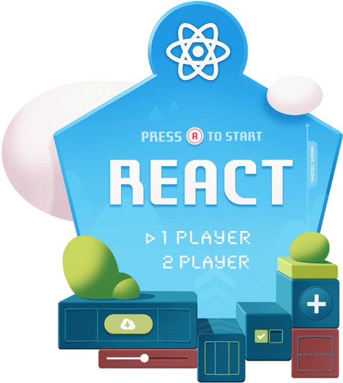
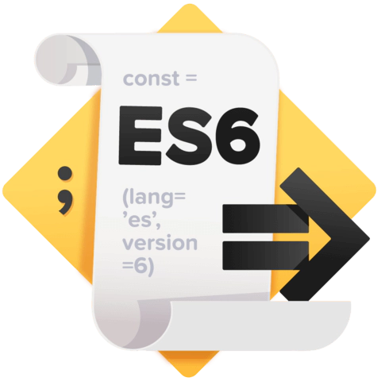
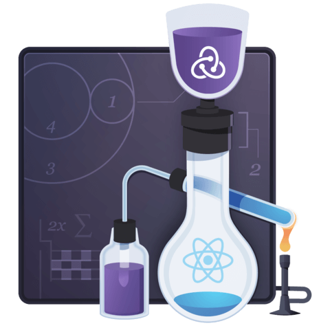

# React.js knowledge base

Welcome to the __React.js__ knowledge base. 🚀

Here you will find all the resources you need to get you started in your journey in one of the web's most popular frameworks for building JavaScript applications, as well as more advanced topics to explore anytime you want to expand your knowledge.

You are also welcome to add new resources that you find interesting as well as fix any errors that you might find along the way.

This knowledge base was structure as a Choose Your Own Adventure game, so feel free to start wherever you feel more conformable. At any point in the process we will provide links to the next chapter.

The following are all the top-level topics you can start with.

## [Javascript, the React parts](/javascript-for-react.md)

Assuming you already have some basic JavaScript knowledge, here you will find the resources you need to start tackling more modern JavaScript syntax that we feel matters the most for learning React and that will probably be very useful as you advance in the topic.

 

## [Basic introduction to `npm`, `nvm` and `yarn`](basic-dev-tools.md)

Building a React.js application involves using multiple packages and even versions of Node.js. That is why having a basic understanding of how `npm` works, what the advantages of using `yarn` are and how to manage your Node.js version with `nvm` is so important.

## [React.js for beginners](/reactjs-for-beginners.md)

Now that you have the basics, it's time to grasp all the fundamentals of React and build your first applications. Here you will find a collection of tutorials that will help you do just that.

## [Advanced React.js tools](advanced-tools.md)

Building an application with React typically involves several tools. Here you will find resources on some of the most used ones to take your React.js journey to the next level. Things like, how to share state across your applications, how to test your components and more.

 
 

## Extra resources

While creating this knowledge base and during our daily coding adventures, we found some interesting resources that didn't have a place to live but that we didn't want to forget so we decided to create this page. Here you will find a list of interesting React related resources. And again, feel free do add you own cool findings. 🖖

  

