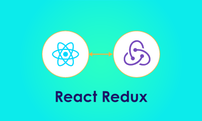

## Redux

Redux is a state management library, it has an official integration with React, called [React-Redux](https://react-redux.js.org/), to learn more about this library you will dive through its fundamentals with the maker of this tool, Dan Abramov, the tutorial is available [here](https://egghead.io/courses/fundamentals-of-redux-course-from-dan-abramov-bd5cc867).

The objectives for this tutorial are:
- Learn how to add proper state management to your React app;
- Dive through reducers and how to manipulate state changes;
- How to propagate the changes into the components;
- Make a To-do list using this library;
  
## 🛠 Tools
To get a react app setup, there's some background work that still has to be done like setting up a webpack dev server, configuring your babel transpiler, etc. To make our lives easier there are already tools that do this out of the box, but to use it, it helps understanding what they do. Apart from this setup shenanigans, in a real environment having your code supported by tests will help you prevent major code-breaking releases. 

[Here](https://www.tutorialspoint.com/babeljs/babeljs_working_babel_with_webpack.htm) you'll learn more about what Babel does and why do we need to setup webpack.

After understanding the fundamentals and seeing the amount of boilerplate code it is needed, we introduce the `create-react-app` tool, this tool brings all the basic configuration that a react app needs in order to be up and running. You can learn how to use it [here](https://github.com/facebook/create-react-app)

[Here](https://jkettmann.com/beginners-guide-to-testing-react) you'll dive into the React testing world, you'll learn how to mock API calls and even mock user interactions (clicking a button or typing on an input).

Objectives for these tutorials:
- Learn more about Babel and Webpack;
- See how to create a react project in one minute;
- Learn how to test:
  - Mock User interactions;
  - Mock API Calls;
  - Mock page rendering;
