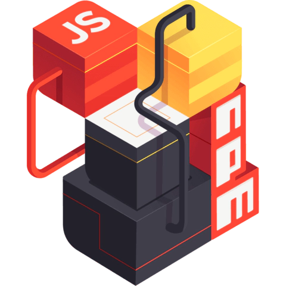

# Basic introduction to `nvm`, `npm`, and `yarn`

## Node Version Manager

During your journey React.js you will probably work on many projects that use different versions of Node.js. That is where a version manager comes in hand.

[Node Version Manager](https://github.com/nvm-sh/nvm) (NVM) is a tool used to manage multiple active Node.js versions.

It allows you to locally download any of the remote Long Term Support (LTS) versions of Node.js with a simple command; easily switch between multiple versions of Node.js, right from the command line and even set up aliases to switch between different downloaded versions of Node.js with ease.

### Installation

#### Remove existing versions
First, remove existing Node.js versions with the following commands. If this is your first time using Node.js and you don't have any versions installed yet you can just skip this step.

```
brew uninstall --ignore-dependencies node 
brew uninstall --force node 
```

#### Install NVM

Now, you system is ready for the installation. Update the Homebrew package list and install NVM.

```
curl -o- https://raw.githubusercontent.com/nvm-sh/nvm/v0.39.1/install.sh | bash
```

Now, configure the required environment variables by adding the below lines to `~/.bash_profile` (or `~/.zshrc` for macOS Catalina or later). You can use `open ~/.zshrc` in the command line to open the files.

```bash
# nvm
export NVM_DIR="$([ -z "${XDG_CONFIG_HOME-}" ] && printf %s "${HOME}/.nvm" || printf %s "${XDG_CONFIG_HOME}/nvm")"
[ -s "$NVM_DIR/nvm.sh" ] && \. "$NVM_DIR/nvm.sh" 
```

### Installing a Node.js version with NVM

First of all, see what Node versions are available to install. To see available versions, type:

```
nvm ls-remote
```

Now, you can install any version listed in above output. You can also use aliases names like node for latest version, lts for latest LTS version, etc.

```
nvm install node     # Installing Latest version 
nvm install 14       # Installing Node.js 14.X version 
```

After installing you can verify what is installed with:

```
nvm ls 
```

If you have installed multiple versions on your system, you can set any version as the default version any time. To set the node 14.X as default version, simply use:

```
nvm use 14
```

Similarly, you can install other versions like Node 12.X or Node 15 and switch between them.

## Node Package Manager



[Node Package Manager](https://www.npmjs.com/) (NPM) is a popular package manager among JavaScript developers. It is the default package that is automatically installed whenever you install Node.js on your system.

It consists of three components: [the website](https://www.npmjs.com/) to manage various aspects of your npm experience, Command Line Interface (CLI) to interact with npm via the terminal, and registry to access an extensive public database of JavaScript software as well as publish your own. 

To install a package using NPM you can search for it in the website, select the package, for example the [`react`](https://www.npmjs.com/package/react) package, and run the install command.

```
npm install <package name>
```

Uninstalling packages can be done by calling the npm uninstall command followed by the package name.

```
npm uninstall <package name>
```

## Yarn

[Yarn](https://classic.yarnpkg.com/en/) is another popular package manager for the JavaScript programming language. The intention behind creating Yarn was to address some of the performance and security shortcomings of working with `npm` (at that time).

Since then, `npm` has undergone several improvements to fix some of its inefficiencies. As a result `npm` and `yarn` are now in a neck-to-neck race over which package manager trumps the other.

According to the official documentations, the recommended way to install Yarn in your project is through the node package manager using the following command:

```
npm install yarn
```

To install a package using Yarn you can search for it in the website, select the package, for example the [`react`](https://classic.yarnpkg.com/en/package/react) package, and run the install command.

```
yarn add <package name>
```

Uninstalling packages can be done by calling the yarn remove command followed by the package name.

```
yarn remove <package name>
```

And to uninstall it:
```
yarn remove react
```

[<< Back](/README.md)