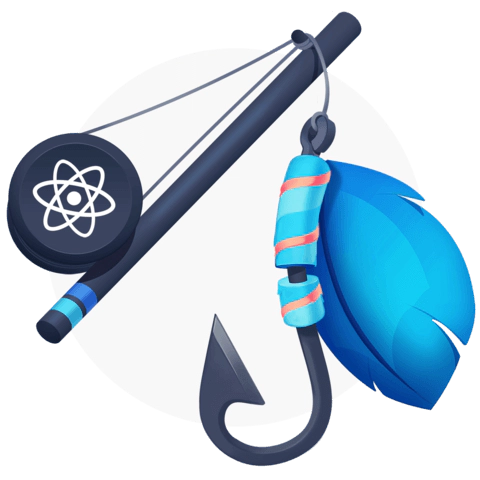

# React.js for beginner

## What is React.js

`React.js` is an open-source JavaScript library that is used for building user interfaces specifically for single-page applications.

It was first created by Jordan Walke, a software engineer working for Facebook, and is now one of the most commonly used frontend libraries for web development.

Although React is a library rather than a language, it is widely used in web development since it allows developers to create large web applications that are constantly refreshing data in the UI. This technology eliminates the need of reloading the whole screen and also avoids processing every single line of code.

__The main purpose of React is to be fast, scalable, and simple.__

## Getting Started

### The official documentation
There is no better way to get started in React.js than the official documentation. [Here](https://reactjs.org/docs/hello-world.html) you will find a brief description of the main concepts as well as links to CodePen where you can change the code and see what it does in real time. The goal here is for you to start think in React.

### The Beginner's Guide to React
Once you're done with the official documentation it's time to build a solid foundation with [The Beginner's Guide to React](https://egghead.io/courses/the-beginner-s-guide-to-react). It is a 28-part course with short lessons where you'll learn many interesting think like how to:

* What is JSX and how to use it effectively with React
* Create simple and reusable React components
* Style React components with className and inline Styles
* What are hooks and how to create your own
* Make and manage basic forms
* Make HTTP requests
* Install and use React DevTools for debugging
* Build and deploy a React Application with Codesandbox, GitHub, and Netlify

## React Hooks

Hooks are a feature introduced in the React 16.8 version. It provides an alternative to writing class-based components, and offers an alternative approach to state management and lifecycle methods.

Since they were already introduced in the [The Beginner's Guide to React](#the-beginners-guide-to-react) we give you two suggestions on how to expand your knowledge in this subject:

1. Go trough the [official documentation](https://reactjs.org/docs/hooks-intro.html) for an overview of how the hook work (or experienced React users)
2. Learn how they work in a more in-depth way with the [Build Advanced Components with React Hooks](https://egghead.io/courses/build-advanced-components-with-react-hooks-810906cc) course where you will learn how to:

    * Manage React component state with useState
    * Share values throughout an application with Context
    * Build a React compound component
    * Render multiple pages in a Wizard form
    * Handle complex state updates with useReducer

## React Router

Even tough React is built for single-page applications we can still build apps with multiple routes using [React Router](https://reactrouter.com/). It that allows you to handle routes in a web app, using _dynamic routing_,  meaning routing that takes place as your app is rendering, not in a configuration or convention outside of a running app. That means almost everything is a component in React Router.

A great way to learn about React Router is using the [official tutorial](https://reactrouter.com/docs/en/v6/getting-started/tutorial) that will cover the following topics:

* Configuring Routes
* Navigating with Link
* Creating Links with active styling
* Using Nested Routes for Layout
* Navigating programmatically
* Using URL params for data loading
* Using URL Search params
* Creating your own behaviors through composition
* Server Rendering

## Build your first app
