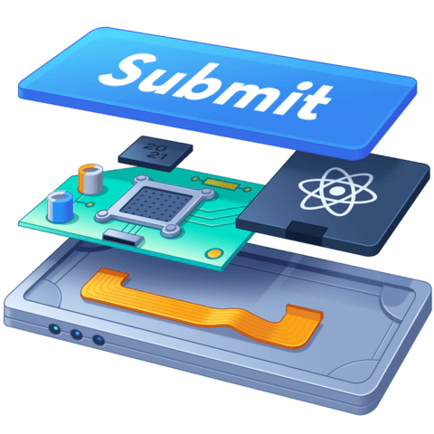

# React.js for beginners

## Table of contents
1. [What is React.js](#atom_symbol-what-is-reactjs)
2. [Getting Started](#rocket-getting-started)
3. [React Hooks](#hook-react-hooks)
4. [React Router](#arrow_right_hook-react-router)
5. [Authentication](#lock-authentication)
6. [Build your first app](#technologist-build-your-first-app)

 

## :atom_symbol: What is React.js

`React.js` is an open-source JavaScript library that is used for building user interfaces specifically for single-page applications.

It was first created by Jordan Walke, a software engineer working for Facebook, and is now one of the most commonly used frontend libraries for web development.

Although React is a library rather than a language, it is widely used in web development since it allows developers to create large web applications that are constantly refreshing data in the UI. This technology eliminates the need of reloading the whole screen and also avoids processing every single line of code.

__The main purpose of React is to be fast, scalable, and simple.__

## :rocket: Getting Started

### The official documentation
There is no better way to get started in React.js than the official documentation. [Here](https://reactjs.org/docs/hello-world.html) you will find a brief description of the main concepts as well as links to CodePen where you can change the code and see what it does in real-time. The goal here is for you to start to think in React.

### The Beginner's Guide to React
Once you're done with the official documentation it's time to build a solid foundation with [The Beginner's Guide to React](https://egghead.io/courses/the-beginner-s-guide-to-react). It is a 28-part course with short lessons where you'll learn many interesting things like how to:

* What is JSX and how to use it effectively with React
* Create simple and reusable React components
* Style React components with className and inline Styles
* What are hooks and how to create your own
* Make and manage basic forms
* Make HTTP requests
* Install and use React DevTools for debugging
* Build and deploy a React Application with Codesandbox, GitHub, and Netlify

## :hook: React Hooks

Hooks are a feature introduced in the React 16.8 version. It provides an alternative to writing class-based components and offers an alternative approach to state management and lifecycle methods.

Since they were already introduced in the [The Beginner's Guide to React](#the-beginners-guide-to-react) we give you two suggestions on how to expand your knowledge in this subject:

1. Go through the [official documentation](https://reactjs.org/docs/hooks-intro.html) for an overview of how the hook work (or experienced React users)
2. Learn how they work in a more in-depth way with the [Build Advanced Components with React Hooks](https://egghead.io/courses/build-advanced-components-with-react-hooks-810906cc) course where you will learn how to:
    * Manage React component state with useState
    * Share values throughout an application with Context
    * Build a React compound component
    * Render multiple pages in a Wizard form
    * Handle complex state updates with useReducer

Here is the [github repo](https://github.com/matiasfha/egghead-build-wizard-with-hooks-collection) for that course.

## :arrow_right_hook: React Router

Even though React is built for single-page applications we can still build apps with multiple routes using [React Router](https://reactrouter.com/). It allows you to handle routes in a web app, using _dynamic routing_,  meaning routing that takes place as your app is rendering, not in a configuration or convention outside of a running app. That means almost everything is a component in React Router.

A great way to learn about React Router is using the [official tutorial](https://reactrouter.com/docs/en/v6/getting-started/tutorial) that will cover the following topics:

* Configuring Routes
* Navigating with Link
* Creating Links with active styling
* Using Nested Routes for Layout
* Navigating programmatically
* Using URL params for data loading
* Using URL Search params
* Creating your own behaviors through composition
* Server Rendering
  

## :lock: Authentication

In real use cases, your web application will need to be authenticated, like profile pages or even just managing your favorite movie lists. The authentication flow will be different from app to app, some apps will need to authenticate via an authorization server, others via an API, and even though SSOs (Single Sign-On), the majority of these implementations will have something in common, using a JWT (JSON Web Token) to identify and authorize your user. There are many ways to store this token such as:
* Cookies - using this [package](https://www.npmjs.com/package/react-cookie) for example
* Local Storage - this uses your browser local storage and will be available through the Window.localStorage [API](https://developer.mozilla.org/en-US/docs/Web/API/Window/localStorage) and there is already an implementation using the React hooks [here](https://usehooks-ts.com/react-hook/use-local-storage)

There are plenty more options, some of them are easier to implement, others more difficult but they add more security to your app, you can look into this [guide](https://www.digitalocean.com/community/tutorials/how-to-add-login-authentication-to-react-applications) and follow the implementation of an authentication flow in a React App.

Using the React Router library (see [here](#arrow_right_hook-react-router)), you can prevent unauthenticated users from accessing certain routes of your app, so building a Route component that uses the token described previously to authorize users is one of the most common patterns in setting up Authentication and Authorization in your app. The official documentation has an example of how to set up authenticated routes [here](https://reactrouter.com/docs/en/v6/examples/auth).

## :technologist: Build your first app

Now that you have learned the basics of React.js, it's time to create your first app. Here we are going to use the [API](https://www.themoviedb.org/documentation/api) for The Movie Data Base (TMDB) to get data and show it in our application but you can use any API you prefer. Here is a list of public APIs: https://github.com/public-apis/public-apis

With the TMDB we can create a movie database app, where the user can search for movies, TV shows, and crew members.

Since making CSS is not the goal here, we recommend you use a package with pre-made CSS components:
* [Bulma](https://bulma.io/)
* [Bootstrap](https://react-bootstrap.github.io/)
* [Material UI](https://mui.com/pt/)

Here is our suggestion on where to start.

    
💡

    

        
Useful tip

        
A good way to organize your app is by using these 4 folders: <strong>pages</strong>, where you will have your page components; <strong>components</strong>, where you will store the components used by your pages; <strong>assets</strong>, where you can store things like CSS files and images used; and <strong>helpers</strong>, where you can store files with helper functions, like the ones you can create to make any requests to the API.

        
If you are interested in learning more about folder structure, here is an <a href="https://medium.com/@kumarvinoth/finally-a-better-react-js-folder-structure-821a2210835">interesting blog post</a> about that.

    

### 1. Request an API key
The API is free and available for everyone to use but to make a request you need to create a user account and then [request an API key](https://www.themoviedb.org/settings/api).

### 2. Create the home page
This is the first page the user will see in your application. Here you can have show the 5 [most popular movies](https://developers.themoviedb.org/3/movies/get-popular-movies) as well as an input to allow the user to search by TV shows, movies, or people using this endpoint: https://developers.themoviedb.org/3/search/multi-search

After clicking the search button — and if there is something to search for —, the user should be redirected to another page where the search results will appear (5 for each category is enough).

    
💡

    

        
Useful tip

        
At the beginning you can focus on just having a simple input that records the user input and a button that, when clicked, redirects the user to the page <code>/results?search=user-input</code>, where you can just show the user input inside a <code>div</code>.

        
After that you can increased the complexity by making your requests and showing the results as buttons. That way you can test just the basic structure of your app without having to worry about styles and showing the complete information.

    

### 3. TV Show page
This is the page for the TV Show. Here you can use the URL params to get the TV show ID and show the following:
* Details: https://developers.themoviedb.org/3/tv/get-tv-details
* Credits: https://developers.themoviedb.org/3/tv-seasons/get-tv-season-aggregate-credits

### 4. Movie page
This is the page for the movie. Here you can use the URL params to get the movie ID and show the following:
* Details: https://developers.themoviedb.org/3/movies/get-movie-details
* Credits: https://developers.themoviedb.org/3/movies/get-movie-credits

### 5. Person page
This is the page for a person. Here you can use the URL params to get the person ID and show the following:
* Details https://developers.themoviedb.org/3/people/get-person-details
* TV shows: https://developers.themoviedb.org/3/people/get-person-tv-credits
* Movies: https://developers.themoviedb.org/3/people/get-person-movie-credits

### 6. Connecting everything
Now that we have a specific page for everything we just need to add links so that, in the search results page, when a user clicks a result they are redirected to the specific page. The same thing for the credits, they should redirect to the correct person page.

### 7. Bonus
As a bonus, and if the rest was too easy for you, you can use the knowledge acquired in the previous steps to deploy your app and show it off. 🚀

## The end

Congratulations! 🎉 You have completed the beginners' guide to React.js. This is the end of this chapter but the beginning of your journey with React.js so feel free to [go back to the start](/README.md) and learn more. After all, it's a never-ending story...

    

<!--- CSS -->
